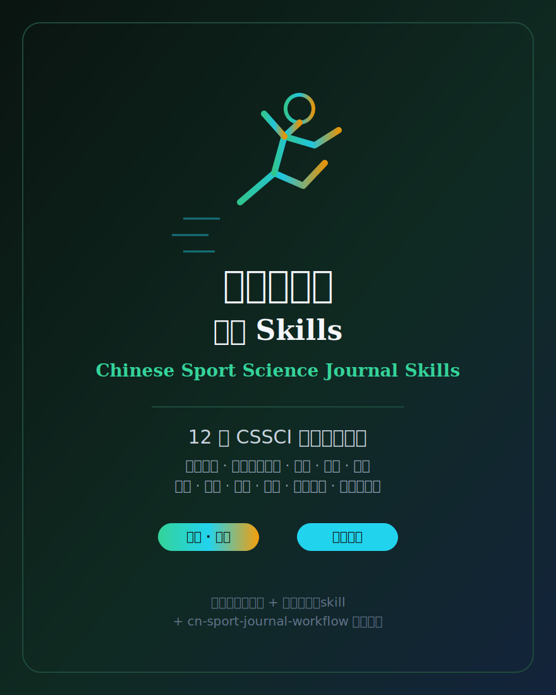

# 中文体育学期刊 Skills（Chinese Sport Science Journal Skills）

  

[English](README.md) | 简体中文

面向 **12 本 CSSCI 体育学（2025–2026）来源刊** 的 agent skill 合集。本包把**体育学**从中文经管社科合集里的「其它」脚注，**升格为独立的一级学科分类**。覆盖学科旗舰《体育科学》与应用偏向的《中国体育科技》（均由中国体育科学学会 / 国家体育总局体育科学研究所体系主办），北京、上海、成都、武汉、西安、沈阳、天津七所体育院校的综合性学报，以及人文社科偏向的《体育学刊》《体育学研究》《体育与科学》。

本合集是 [`Chinese-SocialScience-Journal-Skills`](../Chinese-SocialScience-Journal-Skills/) 的体育学姊妹包。与姊妹包一致：**每刊一张自洽的「定位 + 写作风格」skill**，外加 `cn-sport-journal-workflow` 选刊路由卡。体育学横跨**运动人体科学**（运动生理生化、生物力学、运动医学、体质健康）与**体育人文社会学**（体育社会学、管理、经济、政策、史哲、学校体育、运动训练与竞技体育、民族传统体育），每张 skill 都帮你判断：稿件对不对该刊的口、走自然科学还是人文社科路径、方法证据是否够、投稿前必须回官网核验哪些细则。

## 覆盖

| 分组 | 期刊 | 数量 |
|---|---|--:|
| 学科旗舰（学会主办） | 《体育科学》《中国体育科技》 | 2 |
| 体育院校综合性学报 | 北京体育大学学报 · 上海体育大学学报 · 成都体育学院学报 · 武汉体育学院学报 · 西安体育学院学报 · 沈阳体育学院学报 · 天津体育学院学报 | 7 |
| 人文社科偏向 | 《体育学刊》《体育学研究》《体育与科学》 | 3 |
| **单刊 skill 合计** | | **12** |
| 路由 workflow（`cn-sport-journal-workflow`） | | 1 |

## Skill 清单

| Skill | 期刊 | 主办 / 偏向 |
|---|---|---|
| `china-sport-science` | 《体育科学》 | 中国体育科学学会·学科第一刊 |
| `china-sport-science-and-technology` | 《中国体育科技》 | 体育总局体科所·应用与竞技 |
| `journal-of-beijing-sport-university` | 《北京体育大学学报》 | 北体·综合性 |
| `journal-of-shanghai-university-of-sport` | 《上海体育大学学报》 | 上体·综合性（社科偏强） |
| `journal-of-chengdu-sport-university` | 《成都体育学院学报》 | 成体·体育史 / 民族传统体育见长 |
| `journal-of-wuhan-sports-university` | 《武汉体育学院学报》 | 武体·综合性 |
| `journal-of-xian-physical-education-university` | 《西安体育学院学报》 | 西体·综合性 |
| `journal-of-shenyang-sport-university` | 《沈阳体育学院学报》 | 沈体·综合性 |
| `journal-of-tianjin-university-of-sport` | 《天津体育学院学报》 | 天体·综合性（运动人体科学偏强） |
| `journal-of-physical-education` | 《体育学刊》 | 华南师大·人文社科 / 学校体育 |
| `journal-of-sports-research` | 《体育学研究》 | 南京体院·体育社会科学 / 理论 |
| `sports-and-science` | 《体育与科学》 | 江苏·思辨 / 跨学科人文社科 |

## 怎么用

1. **先路由**：从 `cn-sport-journal-workflow` 起步，按子学科（运动人体科学 / 体育人文社会学 / 竞技训练 / 学校体育）、贡献类型与方法形态分类，拿到候选期刊短名单。
2. **再对口**：打开首选期刊的单刊 skill，检验 scope、框定、方法 / 证据门槛、写作风格与最可能的拒稿触发点。
3. **最后核验官网**：每张 skill 都以官方核验清单收尾。投稿前打开该刊当前投稿须知 / 征稿简则（见 [`resources/official-source-map.md`](resources/official-source-map.md)）—— **以官网为准**。

## 设计铁律（与姊妹包一致）

- **不写易变事实**：不写影响因子、版面费、ISSN、精确字数 / 栏目 / 编辑姓名 —— 这些在官网且会变。
- **不捏造文献**：文献一律泛指，不编造具体引用。
- **只用稳定惯例**：仅用持久的结构性事实（主办单位、学科偏向、自然科学 vs 人文社科双路径、伦理 / 报告规范）辅助判断对口。
- **官网优先**：官网现行规定与 skill 冲突时，以官网为准。

## 来源纪律

期刊规则会变。[`resources/source-basis.md`](resources/source-basis.md) 记录本包的来源纪律，[`resources/official-source-map.md`](resources/official-source-map.md) 为每本期刊列出官方来源起点。正式投稿前，必须重新核对该刊最新官方投稿须知 / 征稿简则 / 作者指南；若 skill 与官方要求冲突，以官方要求为准。

## 许可

MIT © 2026 Bryce Wang，见 [LICENSE](LICENSE)。
