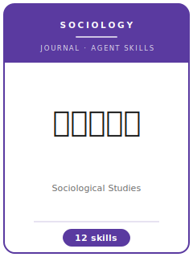

# Sociological Studies Skills

<p align="center">
  
</p>

[](LICENSE)
[](https://shxyj.ajcass.com/)
[](https://shxyj.ajcass.com/)
[](https://github.com/anthropics/claude-code)

English | [简体中文](README.zh-CN.md)

Agent skill stack for manuscripts targeted at **《社会学研究》 (Sociological Studies)** — the flagship sociology journal hosted by the Institute of Sociology, Chinese Academy of Social Sciences (bimonthly; ISSN 1002-5936; CN 11-1100/C).

This repository is opinionated. It is **not** a generic empirical-methods toolbox. It is a **Sociological-Studies-specific** stack built around the journal's defining bar: **a sociological problematic in dialogue with sociological theory — over clean-causal-identification or policy evaluation.**

The journal accepts **both** quantitative survey analysis (CGSS / CFPS / CLDS) **and** qualitative fieldwork (ethnography / interview / extended case / grounded theory). This stack supports both traditions and refuses to collapse sociology into econometrics.

Verified journal facts live in [`resources/journal-profile.md`](resources/journal-profile.md) with source links.

---

## Why a Separate Stack?

《社会学研究》 imposes constraints that differ from economics journals (经济研究 / 中国工业经济) and from the cross-disciplinary flagship (中国社会科学):

| Constraint | Sociological Studies | Implication |
|------------|----------------------|-------------|
| Problem | 社会学问题意识 (mechanism / structure) | "X causes Y" policy framing reads as off-discipline |
| Theory | Dialogue with classic & contemporary sociology | Verifying imported theory ≠ contribution |
| Method | Dual tradition: quantitative + qualitative | Both welcomed; each must be done to craft standard |
| Quant goal | Coefficient → social process | Identification arms race is not the point |
| Qual goal | Material richness + concept building | Story retelling without concepts is rejected |
| Abstract | ≤ 200 Chinese characters; 3–5 keywords | Lead with the problematic, not background |
| Citation | In-text author-date (作者, 年: 页) + end references | Endnotes / numbered footnotes for sources off-style |

---

## The Twelve Skills

| Skill | Role |
|-------|------|
| `socs-workflow` | Router — which skill next; cross-refs other journal packs |
| `socs-fit-positioning` | Sociological problematic vs economics-style evaluation; re-route if the latter |
| `socs-problematic` | Build the sociological problem consciousness (问题意识) |
| `socs-theory-dialogue` | Enter the lineage of classic & contemporary sociological theory |
| `socs-quantitative` | CGSS/CFPS/CLDS; regression / Logit / multilevel / event-history / sequence — with sociological interpretation |
| `socs-qualitative` | Ethnography / interview / extended case / grounded theory; richness, coding transparency, reflexivity |
| `socs-mechanism-social-process` | Translate coefficients / materials into a social process (who, via what, forming what structure) |
| `socs-concept-building` | Extract concepts / mechanisms from materials, going back and forth with theory |
| `socs-style` | Scholarly register; kill policy-report tone AND pure-technique tone |
| `socs-abstract-keywords` | ≤ 200-char abstract + 3–5 keywords per journal norms |
| `socs-submission` | Preflight: in-text citations, end references, online system, anonymity |
| `socs-rebuttal` | R&R response letter |

---

## Quick Start

### Option A — Claude Code Plugin

```bash
/plugin marketplace add https://github.com/brycewang-stanford/awesome-journal-skills
/plugin install sociological-studies-skills
/reload-plugins
```

### Option B — Manual Copy

```bash
mkdir -p ~/.claude/skills && cp -R skills/socs-* ~/.claude/skills/
# or
mkdir -p ~/.codex/skills && cp -R skills/socs-* ~/.codex/skills/
```

---

> Editorial policy evolves. Treat these skills as opinionated heuristics, not official policy — always confirm against the journal's latest 投稿指南 at [shxyj.ajcass.com](https://shxyj.ajcass.com/). The official site is the journal's only submission channel.
